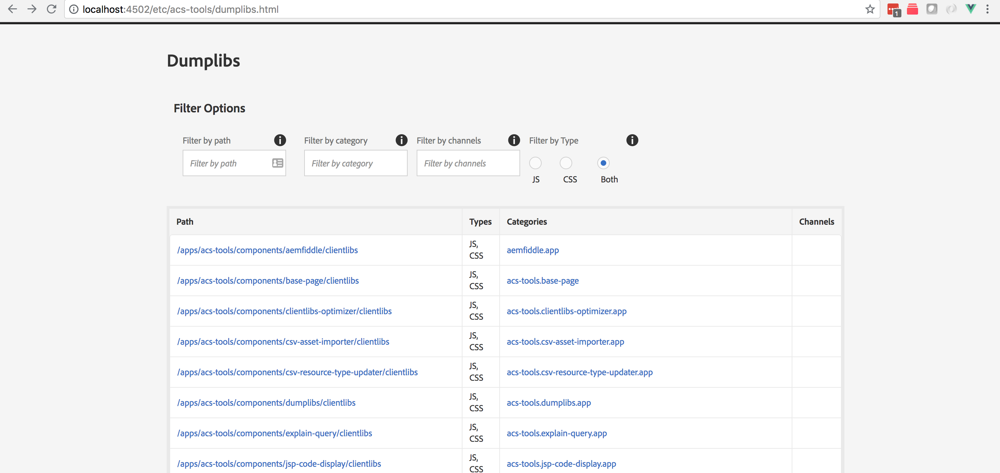

If you've ever used [http://localhost:4502/libs/granite/ui/content/dumplibs.html](http://localhost:4502/libs/granite/ui/content/dumplibs.html) you know that it works, but the UI has room for improvement and sometimes you can't find what you're looking for easily.

ACS AEM Tools' Dumplibs feature tool fixes this, and exposes most of the functionality in the original `dumplibs.html` but with a more usable UI!

The is accessed via [AEM > Tools > ACS AEM Tools > Dumplibs](http://localhost:4502/etc/acs-tools/dumplibs.html).

## Features
  - All clientlibs are loaded on first page load, and then filtered on the front-end
  - You can filter the list of clientlibs via `path`, `categories`, `channels` and `type`. Filters are evaluated with an AND operation.
  - Filters are applied as-you-type :)
  - Clicking on the `path` field will open a dialog showing more details about the clienlib for both `JS` and `CSS` types.
  - Clicking on one of the  `categories` will open a dialog showing ALL clientlibs that use that category for both `JS` and `CSS` types.
  - Links with the `pencil` icon will open that link in CRX/DE for easy access. Clicking the link itself will take you to that link directly.

## Screenshots

## Internal implementation notes

### HTTP API
  - an HTTP API is exposed at `/etc/acs-tools/dumplibs/_jcr_content.app.json`
  - API params:
     - `path`: the clientlib JCR path (takes precedence over `categories` if both are present). returns ONE clientlib
     - `categories` a comma-separated string of the categories to search for. returns ALL clientlibs with categories.
     - `type`: either `JS` or `CSS`
     - `trans`: (used only when `categories` is specified) [transitive](https://helpx.adobe.com/experience-manager/6-4/sites/developing/using/reference-materials/javadoc/com/adobe/granite/ui/clientlibs/HtmlLibraryManager.html#getLibraries(java.lang.String[],%20com.adobe.granite.ui.clientlibs.LibraryType,%20boolean,%20boolean))
     - `themed`: (used only when `categories` is specified) [themed](https://helpx.adobe.com/experience-manager/6-4/sites/developing/using/reference-materials/javadoc/com/adobe/granite/ui/clientlibs/HtmlLibraryManager.html#getLibraries(java.lang.String[],%20com.adobe.granite.ui.clientlibs.LibraryType,%20boolean,%20boolean)) clientlib
  - If no params specified, all clientlibs are returned
