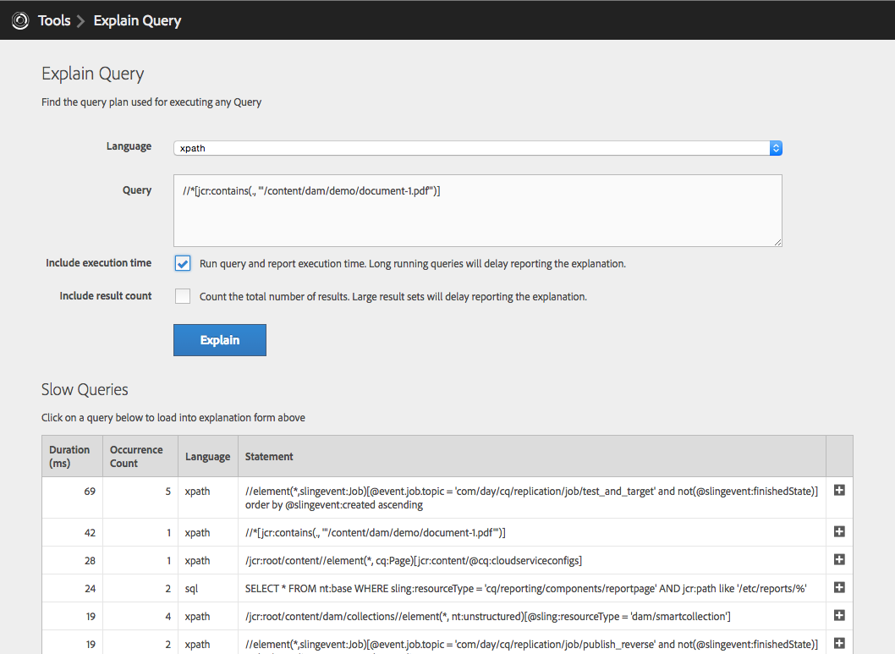
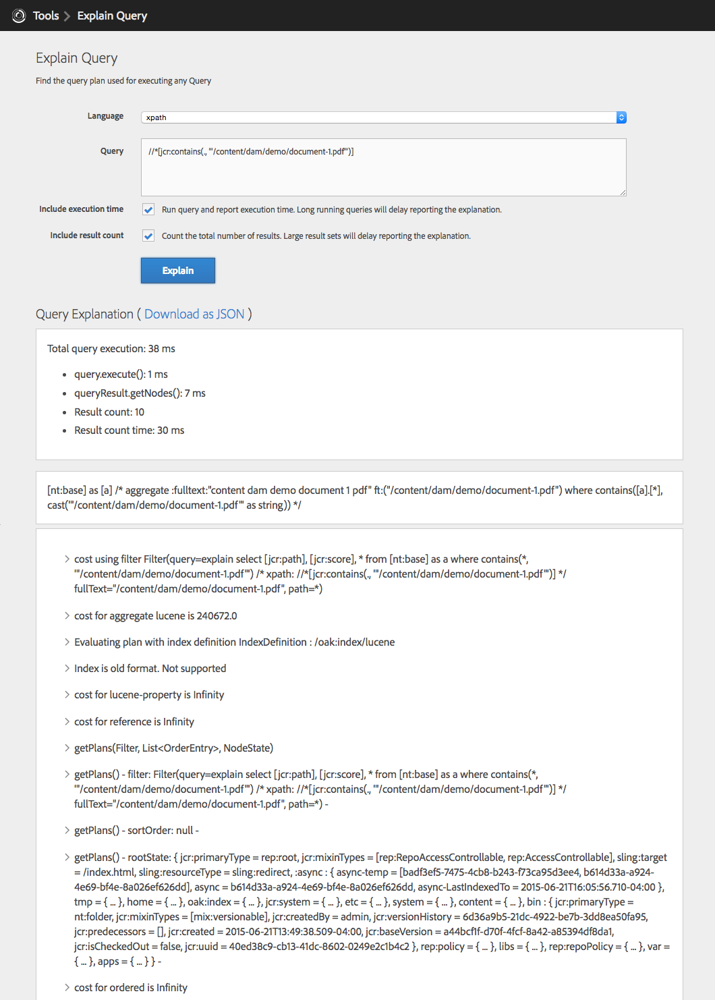
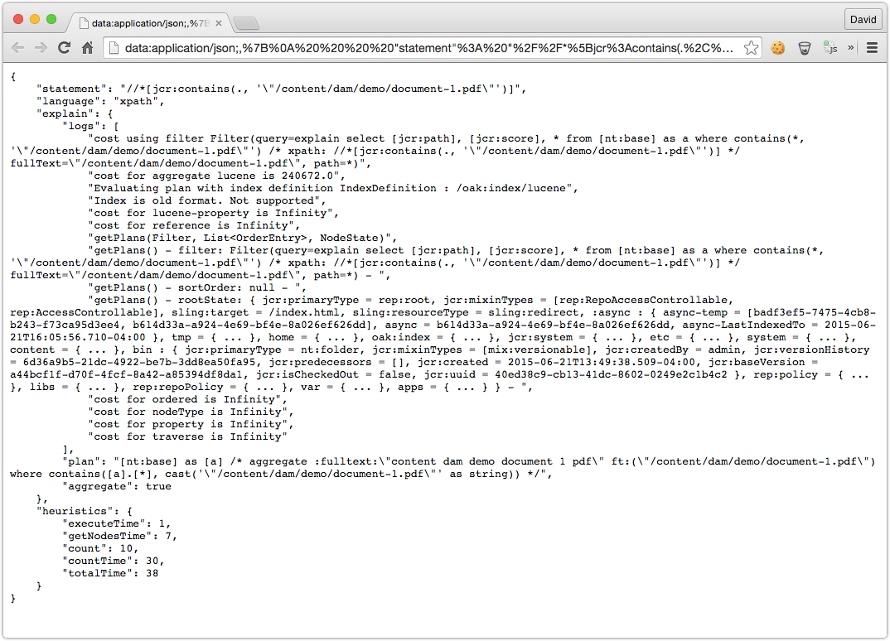
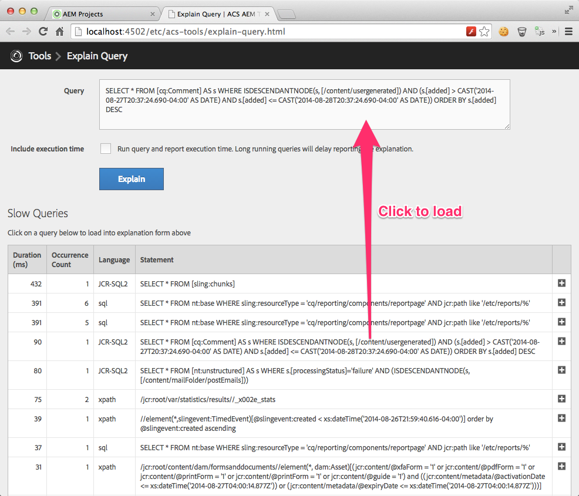

    Since AEM 6.1, Explain Query is part of AEM via the Operations web console, or in AEM as a Cloud Service, via the Developer Console.

   

## Getting Started

> Explain Query only works on AEM6 with Oak based repositories (TarMK/MongoMK)

Install the ACS AEM Tools package via the AEM Package Manager and then open Explain Query from the AEM Tools console, or directly at [/etc/acs-tools/explain-query.html](http://localhost:4502/etc/acs-tools/explain-query.html)

To get to the AEM Tools console from the Touch UI, from the left rail navigation, select Tools > ACS AEM Tools > Explain Query.

## Overview

Explain Query is a tool that explains how Oak is executing a query. For any given query, Oak attempts to figure out the best way to execute based on the repositories defined Oak indexes (under /oak:index). Depending on the query, different indexes may be chosen by Oak. Understanding how Oak is executing a query is the first step to optimizing the query.

#### Explain Query Results

#### Download as JSON

### Explain Query's features

* Xpath, JCR-SQL and JCR-SQL2 and (in v0.0.22) QueryBuilder map support
* Option to execute the provided query and report the actual query execution time
* Slow query detection; Explain query will warn you about potentially slow queries.
* Reports the Oak indexed used to execute the query
* Displays the actual Oak Query engine explanation
* Provides click-to-load list of Slow and Popular queries
* Oak Query Plan log messages (Since v0.0.18)
  * When using Oak 1.0.8 and below, log messages will display however they may be unnecessarily verbose.
* Export results to JSON

