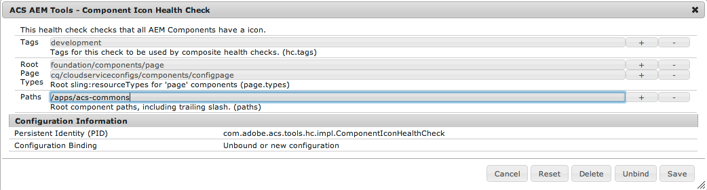
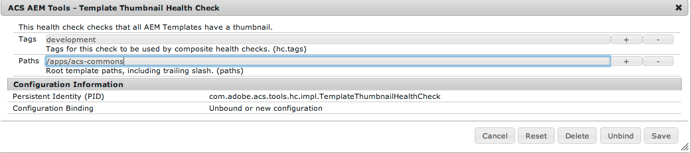
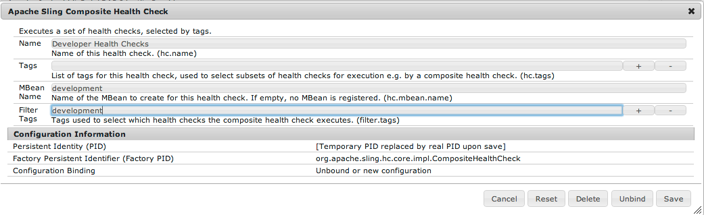
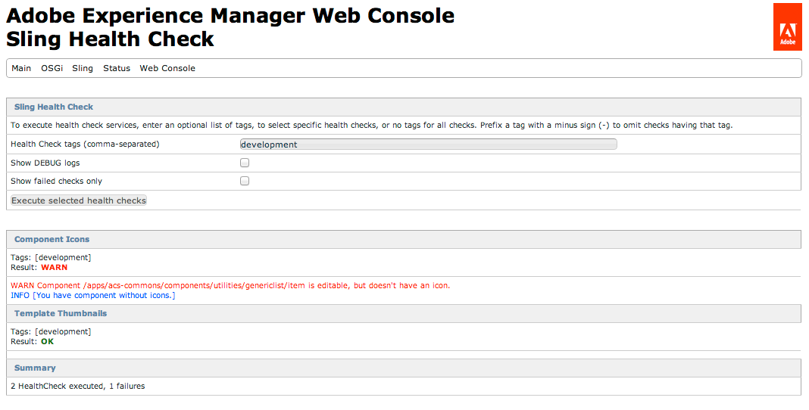

Sling Health Check Tools is a Sling module for checking the health of a running Sling system based on a series of Health Check services. ACS AEM Tools includes two Health Checks for evaluating the quality of development deliverables:

* Component Icon Health Check - ensures that all editable components (components with a dialog, not in the `.hidden` group and not page component) have an icon.
* Template Thumbnail Health Check - ensures that all templates have a thumbnail.

## Installation

For AEM 5.6.1, you will need to manually install the Sling Health Check bundles, downloadable from the [Sling Downloads page](http://sling.apache.org/downloads.cgi).

## Configuration

Both health checks need to be configured with the root path(s) of the application code to be checked. This is done using OSGi configuration. Also set in OSGi configuration in a _tag_ which helps to group Health Checks.

***

***

***

In the case of these screenshots, both Health Checks are tagged with `development`. Using this tag, you can also create a composite Health Check using OSGi configuration:

***

Once configured, the Health Checks are testable through the OSGi Web Console or using JMX.

