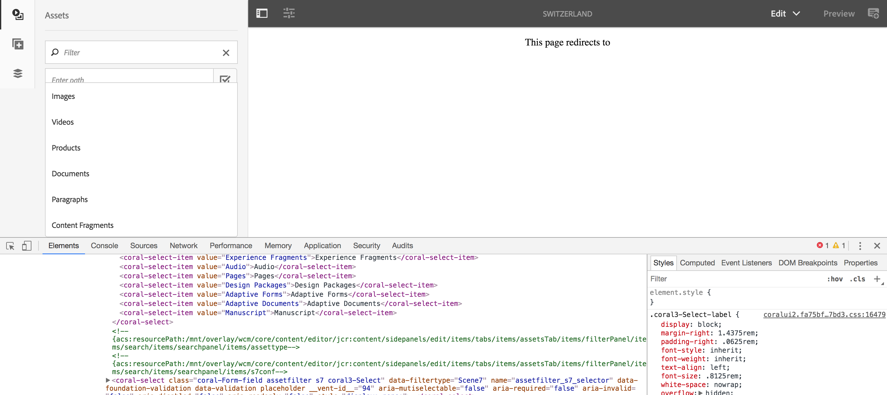
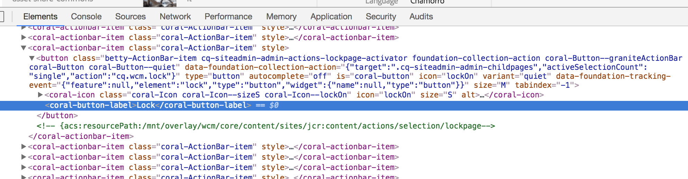
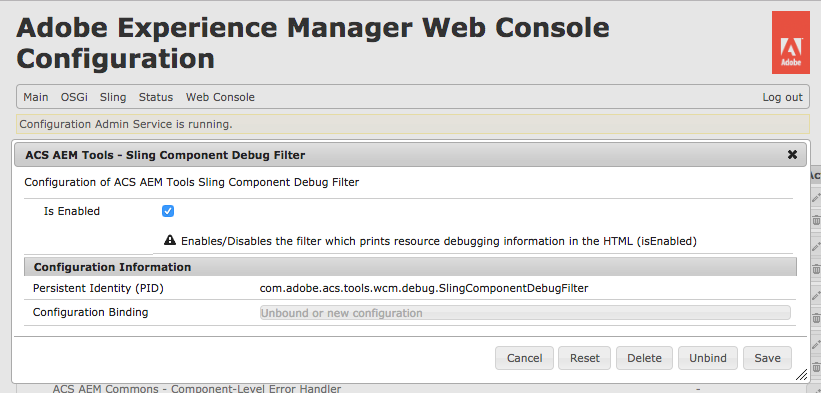

## Problem
This feature is useful when there is a need to customise AEM Touch UI and find out the resource paths of AEM Touch UI Granite components. The Devs currently use non-standard techniques to find out the right paths to be overlaid for customising the Touch UI. These techniques are time consuming and does not provide an instant solution.

## Solution
With this feature the devs can just inspect the HTML of the selected element and find the CRX resource paths in the HTML comments. The solution uses a Sling component filter which filters all requests and injects the resource path in the HTML response of the components.

* The sling component filter works only when it is enabled in OSGI configuration. By default it is disabled.
    * [AEM Web Console > Main > ConfMgr > ACS AEM Tools - Sling Component Debug Filter](http://localhost:4502/system/console/configMgr/com.adobe.acs.tools.wcm.debug.SlingComponentDebugFilter)
* The filter only modifies the response of the requests whose URI contains `.html` extension.
* The format of the HTML comment: `<!-- acs:resourcePath: /path/to/the/included/resource -->`

## Screenshots of example:

### Asset Finder

### Lock Button

## How to enable

1. Navigate to [AEM Web Console > Main > ConfMgr > ACS AEM Tools - Sling Component Debug Filter](http://localhost:4502/system/console/configMgr/com.adobe.acs.tools.wcm.debug.SlingComponentDebugFilter)
    
2. Check the `Is Enabled` checkbox.
3. Tap the `Save` button.

4. Load the HTML page with the component in question, and view source.
5. Search for `acs:resourcePath` until the interesting include is found.

