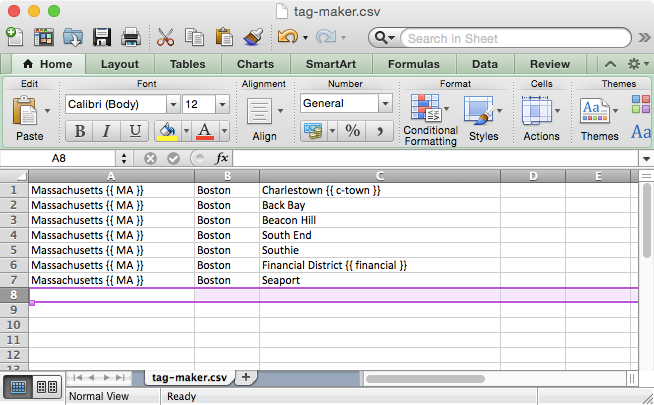
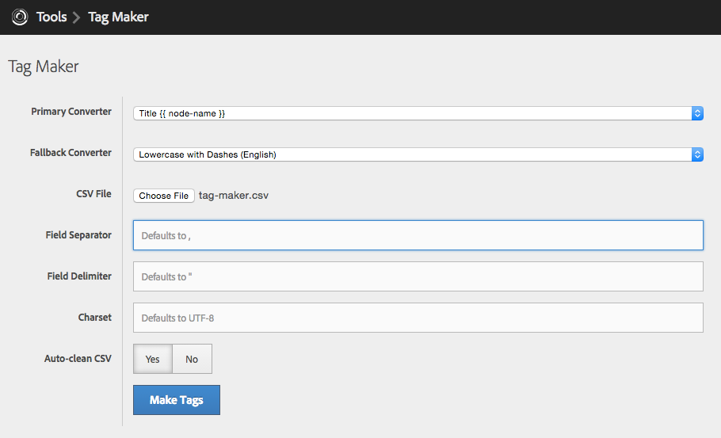
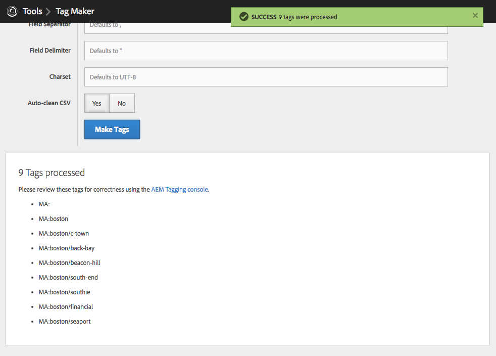
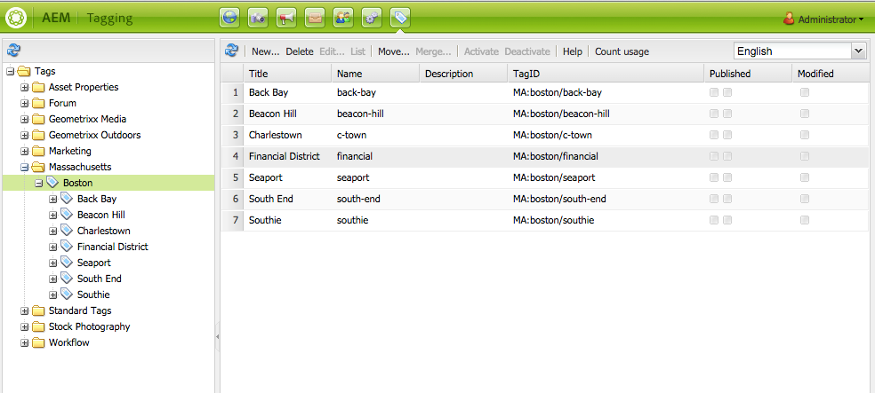

    This feature has effectively been moved to <a href="https://adobe-consulting-services.github.io/acs-aem-commons/features/mcp-tools/tag-creator/index.html">ACS AEM Commons as Tag Creator</a>.
     
     
    Please use ACS AEM Commons' Tag Creator instead of this tool.

   

## Getting Started

Install the ACS AEM Tools package via the AEM Package Manager and then open Tag Maker from the AEM Tools console, or directly at [/etc/acs-tools/tag-maker.html](http://localhost:4502/etc/acs-tools/tag-maker.html)

To get to the AEM Tools console from the Touch UI, select Tools > ACS AEM Tools > Tag Maker.

<iframe width="853" height="480" src="https://www.youtube.com/embed/33hvWMaYPVE" frameborder="0" allowfullscreen></iframe>

## Overview

Tag Maker is a tool aimed at the creation of Tag taxonomies in AEM. Excel provides a  simple, flexible and natural way of modeling Tag taxonomies outside of AEM, however transforming the Excel into AEM Tags can be an arduous process, especially for very large taxonomies.

ACS AEM Tools' Tag Maker bridges this gap by ingesting a CSV file (which Excel exports to), and creating the AEM Tag trees defined in the CSV.

## Data Converters

ACS AEM Tools comes w/ three Tag Converters. These data converts transform the data in the Excel cells to Tag Titles and node names.

Data Converters act upon each cell in the Excel document, transforming it into a Tag.

Note: The first column is treated as the Tag Namespace.

### Default

* Tag title: The cell value as is
* Node name: Transforms the cell value using `JcrUtil.createValidName(..)` and forces the result to lower-case

### Lowercase with Dashes (English)

* Tag title: The cell value as-is
* Node name: Transforms the cell value using the following rules:
 * Removes leading and trailing whitespace
 * Converts to lower-case
 * Replaces all '&' with ' and '
 * Replaces all '/' with ' or '
 * Replaces all '%' with ' percent '
 * Replaces all non-alphanumeric characters with '-'
 * Removes all instances of '-' from the start
 * Removes all instances of '-' form the end

### Title {{ "{{ node-name " }}}}

Expects the cell value to be in the following format: `Tag Title {{ "{{ node name "}}}}`

* Tag title: Everything in the cell before first instance of `{{"{{"}}` with leading and trailing white-space removed.
* Node name: Everything between `{{"{{"}}` and `}}` with leading and trailing white-space removed.

### Localized Titles

Expects the cell value to be in the following format: `default[Default Title] locale_code1[Localized Title] ... locale_codeN[Localized Title] {{ "{{ node name "}}}}`

* Localized Tag titles 
  * Default: `default[Default Title]` the faux locale of "default" indicates the default Tag title (`[cq:Tag]@jcr:title`). If no default is provided the first localized title is used as the default title value.
  * Locales: Each localized title is provided via a space seperated list in the format of `locale_code[Local Title]`
     * Examples:`en[Title] fr_fr[Titre] es[Titulo]`
* Node name: Everything between `{{"{{"}}` and `}}` with leading and trailing white-space removed. Note the node name is not localized.

### event-user-data (Since v0.0.30)

`event-user-data` of `acs-aem-tools.tag-maker` is set for modifications invoked by this feature.