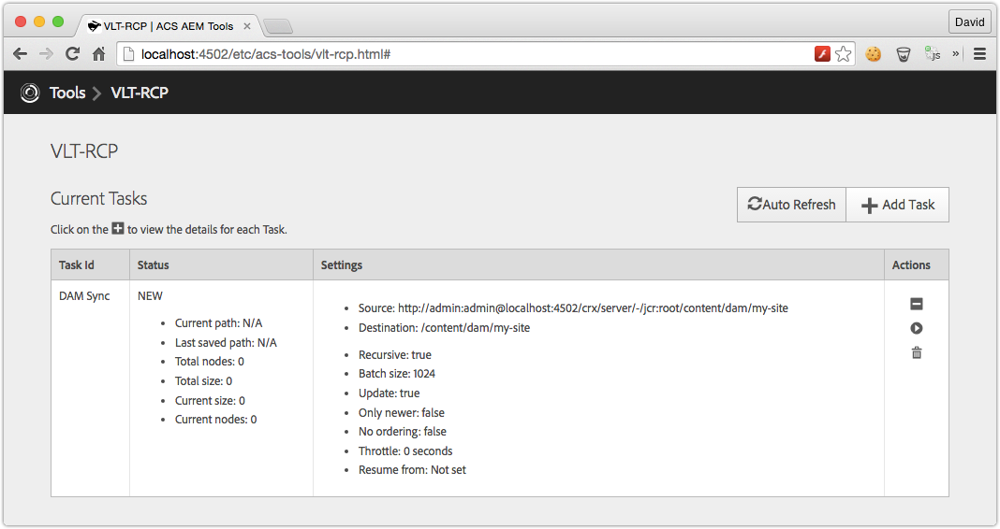

Since ACS Tools v0.0.52, <a href="http://mvnrepository.com/artifact/org.apache.jackrabbit.vault/org.apache.jackrabbit.vault.rcp">Jackrabbit FileVault RCP Server Bundle 3.1.40+</a> is required. 

## Getting Started

Install the ACS AEM Tools package via the AEM Package Manager and then open VLT-RCP from the AEM Tools console, or directly at [/etc/acs-tools/vlt-rcp.html](http://localhost:4502/etc/acs-tools/vlt-rcp.html)

To get to the AEM Tools console from the Touch UI, from the left rail navigation, select Tools > ACS AEM Tools > VLT-RCP.

> [Download](http://mvnrepository.com/artifact/org.apache.jackrabbit.vault/org.apache.jackrabbit.vault.rcp) and install the latest Jackrabbit VLT-RCP Bundle on AEM.

## Overview

ACS AEM Tools VLT-RCP is a WebUI for for Jackrabbit VLT-RCP. New tasks can be created, started and deleted.

