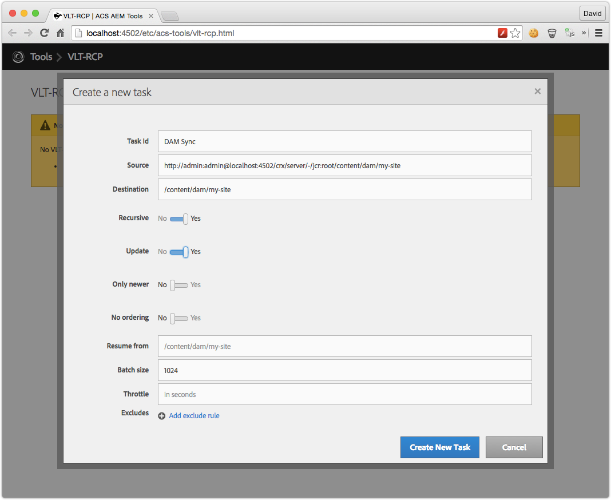

Since ACS Tools v0.0.52, <a href="http://mvnrepository.com/artifact/org.apache.jackrabbit.vault/org.apache.jackrabbit.vault.rcp">Jackrabbit FileVault RCP Server Bundle 3.1.40+</a> is required. 

## Getting Started

Install the ACS AEM Tools package via the AEM Package Manager and then open VLT-RCP from the AEM Tools console, or directly at [/etc/acs-tools/vlt-rcp.html](http://localhost:4502/etc/acs-tools/vlt-rcp.html)

To get to the AEM Tools console from the Touch UI, from the left rail navigation, select Tools > ACS AEM Tools > VLT-RCP.

> [Download](http://mvnrepository.com/artifact/org.apache.jackrabbit.vault/org.apache.jackrabbit.vault.rcp) and install the latest Jackrabbit VLT-RCP Bundle on AEM.

## Overview

ACS AEM Tools VLT-RCP is a WebUI for for Jackrabbit VLT-RCP. New tasks can be created, started and deleted.

### Updates in v1.0.0

1. **New Features**
   - Additional action button to duplicate an existing task. Ie. create a new task based on an existing task's values, but with a new ID. Since editing a task is not an option, this is very handy when a user makes a mistake or just does not want to re-add al the field values
2. **UI enhancements**
   - The previous UI used a table and bullet lists. Also, upon expanding a task, the UI shifts to adjust to the new text making it hard to follow. This PR uses an accordion instead. All visible labels/values are the same, just presented in a better way that keeps the values where they are.
   - The previous UI did not respect expanded tasks when the auto-refresh button is on. This PR keeps the expanded tasks expanded even after the tasks have been updated (refreshed)
   - Added small space between the auto-refresh text and icon
   - removed the explanation for the expand/collapse icon as that was removed in favor of an accordion
3. **Bug fixes**
   - The `removeCredentials` filters was throwing `undefined` errors. does not affect user experience but fixed nonetheless.
4. **Code Format and comments**
   - Fixed some HTML formats and added comments where I could (in both HTML and JS)

